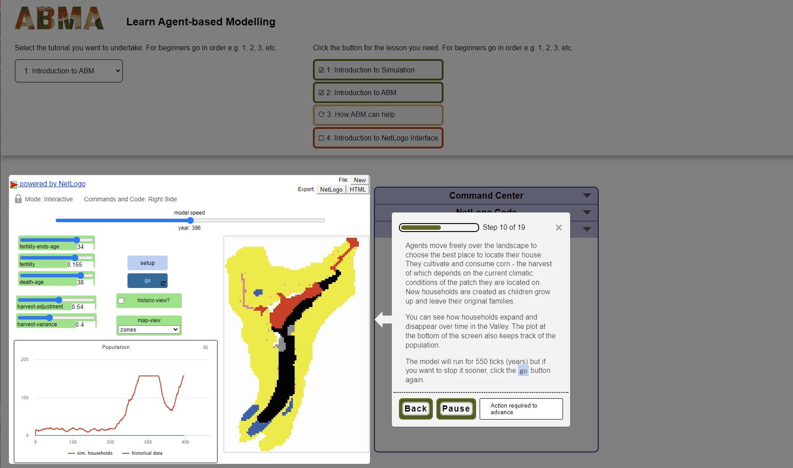

```{r setup, include=FALSE}
knitr::opts_chunk$set(echo = FALSE, warning = FALSE, message = FALSE)
library(ggplot2)
library(dplyr)
library(tidyr)
library(forcats)
library(ggpubr)
# read data
pre_surveys <- readRDS("data/pre_workshop_surveys.rds")
post_surveys <- readRDS("data/post_workshop_surveys.rds")
# factore levels for charts
factor_levels <- c("Excellent", "Good", "Sufficient", "Insufficient", "Not shared")
# readable event names
event_names <- as_labeller(c("202304_CAA" = "CAA", "202308_EAA" = "EAA", "202310_CAA-DE-NLFl" = "CAA-DE-NLFl", "202311_Reuvensdagen" = "Reuvensdagen", "202311_CAA_UK" = "CAA_UK", "202312_Leiden" = "Leiden", "202401_Aarhus" = "Aarhus"))
events <- read.csv("data/events.csv", sep = ";")

```

**Abstract**

Agent-based modelling (ABM) is one of the most widely applied computational modelling research techniques in archaeology, because it is well suited to the questions asked by archaeologists. However, the access to vocational training for ABM is limited. In this paper we present the Open Educational Resources (OER) that we produced in an international cooperation. For this purpose, we created online and open tutorials for ABM for archaeologists. In addition, how-to guides and support material were created, both for teachers and students. The materials adhere to international (European) standards in relation to education and the Digital Skills Passport for archaeology. The teaching materials have been well tested using a diverse group of archaeologists during various international conferences and meetings. It was shown that the knowledge and skills of the participants in relation to ABM improved. In addition, the demand for the teaching materials and the workshops was high, ensuring that the tutorials on ABM will be used in the future.

# Introduction

Computational modelling has become a standard research technique across most scientific disciplines, including archaeology. Among the many computational modelling techniques, the discipline has found agent-based modelling to be particularly well suited to the questions asked by archaeologists. Agent-based modelling is a simulation technique where autonomous agents interact with each other and with their environment. Their aggregated behaviour gives rise to system-level outcomes, thus enabling researchers to understand how *micro* (individual) *mechanisms* lead to *macro* (system-level) *patterns*.

Although the importance of agent-based modelling in archaeological practice is steadily growing [@romanowska2023] there are significant barriers to its wider adoption. While education on ICT skills related to techniques like GIS and databases have found their way into many study programmes [@visser2016; @garstki2022], the access to vocational training required to gain the necessary computer programming and modelling skills for ABM is limited. A survey of practitioners [@davies2018] found significant deficiencies in the provision of ABM training; 70.8% of modellers were primarily self-taught with some degree of secondary support, either by peers or academic supervisors. Only 13.8% received training as a formal part of a degree. While ABM is taught outside of archaeology [e.g. @augustijn2019] and various handbooks exist in different domains [@acerbi2023; @crooks2019; @wilensky2015; @hamill2016; @smaldino2023; @railsback2019], it is lacking in most archaeological curricula due to for example lack of expertise in a university or competition with other subjects to be taught in a given curriculum. There are several online courses available, (e.g. <https://acerbialberto.com/IBM-cultevo/>, <https://smaldino.com/wp/abm-courses/>, <https://forum.comses.net/t/educational-resources/9159>), but none are aimed at archaeology. The lack of training material on ABM for archaeologists, leaves this important method in digital archaeology at the "fringes of the archaeological discipline" [@daems2020, 90] rather than moving it to the front lines.

A consortium of Landward Research Teoranta, Aarhus University, Leiden University and Saxion University of Applied Sciences recognised this need, and sought to address the limited opportunities that archaeologists have to access high quality training. A project was set up to create and make available open learning materials that could be integrated into a wide range of training programmes, such as face-to-face training, employer-focussed continuing professional development seminars, webinars, MOOCs (Massive Open Online Courses) and self-directed learning.

This project, Agent-Based Modelling for Archaeologists (ABMA), was delivered with the support of the Erasmus+ programme of the European Union.

# Methods

## Open educational resources

The ABMA project sought to create Open (Open Access and Open Source) Educational Resources (OERs) for training in Agent-Based Modelling for Archaeologists. These OERs were to be HTML- and JavaScript-based so they could be used on any device with a browser, even if it is not connected to the internet. The full programme consists of five hands-on practical tutorials, taking learners through the process of creating digital models. The modular architecture ensures that they can be independent or incorporated into other teaching tools like learning management systems. They are also deliberately 'method agnostic' so they can be incorporated into any tools from self-teaching to MOOCs, and are supported by a set of materials to encourage use of the OERs.

The activities that the project implemented included:

-   development of a hands-on vocational training programme, aligned with the recently published textbook *Agent-Based Modelling for Archaeology: Simulating the Complexity of Societies* [@romanowska2021a];

-   conversion of the training programme into modular learning resources that are interactive, based on HTML and JavaScript standards;

-   creation of support materials to encourage use of the OERs;

-   creation of how-to guides to help trainers incorporate OERs into their teaching;

-   creation of a code and learning materials repository that will allow the project to ensure sustainability after the European Union support has ended and to facilitate the creation of an open-source community to manage and improve the OERs in the future;

-   development of a framework for skills acquisition aligned with the Digital Skills Passport;

-   promotion through a series of multiplier events.

## Objectives and target audience

The expected results and outcomes, for the target audience of professional archaeologists, were:

1.  a surge in professionals who can build, apply, and critique archaeological simulation, thus opening new research avenues for the discipline as a whole;

2.  increased level of digital competence, specifically in advanced computer skills that are highly transferable to other industries. This includes technical skills such as programming, but also "soft" skills related to computational thinking;

3.  improved opportunities for archaeologists to work in other European countries (transnational mobility) through matching the skills being delivered with the European Commission's Digital Competence Framework for Citizens (2.2) and the sectoral Skills Passport for Archaeology, which means that it will be easier for individual workers to demonstrate their skills to employers across Europe;

4.  increased opportunities for professional development by having access to professional training that can be incorporated into formal or non-formal/informal learning.

For the secondary target audience of vocational training providers in archaeology, e.g. employers, colleges and not-for-profit organisations, the expected results and outcomes were:

1.  increased quality of training in Agent-based Modelling that is free and open;

2.  access to teaching materials for skills that are in high demand and aligned with employers' needs.

We were able to draw on previous experiences with a small private online course (SPOC) on 'Modelling and Simulation in Archaeology' that some of us designed for graduate teaching at the Faculty of Archaeology, Leiden University, where we taught this course in 2016/17 and again in 2018/19 [@scherjon2019]. For this course we developed new online teaching materials comprising pre-recorded lectures, practical exercises, reading assignments and exams. While we greatly benefited from that experience, the target group of the SPOC was graduate students with prior experience in digital archaeology, whereas the ERASMUS+ project was aimed at a much broader target group of archaeology students and professionals whose computational literacy could not be assumed.

## Online tutorials

The project team developed five online tutorials. The tutorials were first designed using storyboards and later converted into interactive guided walk-throughs using NetLogo Web (<https://www.netlogoweb.org/launch>) and Javascript and hosted on GitHub (<https://github.com/ABMArchaeologists/ABMA_tutorials>). During the project, initial testing was done by all authors and the issues functionality in GitHub was used to tackle bugs.

The ABMA learning materials assume that participants have learning skills at least at a secondary education level. Also, they are suitable for participants with at least some background in archaeology, such as those typical among students after the first year of a Bachelor study in Archaeology, i.e., above EQF levels 4 or 5. In addition, the tutorials are aimed at professionals working in archaeology who have some experience with computer applications. We also assume that learners are proficient in English and have at least the Reading B1 level, but Reading B2 is recommended [@councilofeurope2020]. The tutorials were also developed with a secondary aim to develop learners' general skills in the following competence areas: 1. Information and data literacy, 2. Communication and collaboration, 3. Digital content creation and, 5. Problem solving [@europeancommissionjointresearchcentre2022].

After initial debugging by the project team, the tutorials were tested on a wider sample of participants during several online and in-person events, all of which were run by members of the project team (Table \@ref(tab:events)). Recognising the difficulty of delivering practical training in an online environment (Microsoft Teams and Zoom) during the online events, several members of the team were present which enabled participants to go to break-out rooms with an expert if they needed additional help or wanted to discuss things. Throughout the project we sought feedback from the participants and used it to improve the tutorials prior to the following events. The feedback was obtained through two surveys using Qualtrics (<https://www.qualtrics.com/>). The participants of the events were asked to respond to one survey before the start of the event and another one after the end of the event. The first survey focused on the background of the participants and their original level of knowledge in relation to ABM (see appendix 1 for the questions). At the end of the event the participants were asked to answer a second survey. Questions of this survey were aimed at measuring the effectiveness of the tutorials and getting feedback on the workshop and tutorials (see appendix 2 for the questions). For some events participants had to register beforehand and we were able to send the pre-workshop survey by email. At other events no registration was possible or necessary and the pre-workshop survey was shared at the start of the event. The post-workshop survey was distributed using QR-codes or links at the end of the event.

```{r, events, echo=FALSE, tab.cap= "Conferences, events and situations where workshops were held at which the tutorials were tested." }
knitr::kable(events, align = "l", col.names = c("Conference or event", "Period", "Online, in person or hybrid", "Number of participants", "Number of registrations")) 
```

The surveys were analysed using R [@rcoreteam2023]. The following packages were used for analyses: ggplot2 [@wickham2016], dplyr [@wickham2023a], tidyr [@wickham2023], forcats [@wickham2023b], lubridate [@grolemund2011] and stringr [@wickham2023c]. For the sake of reproducibility [@marwick2017] this paper was written in R Markdown (<https://rmarkdown.rstudio.com/>), with data and code available at <https://github.com/ABMArchaeologists/ABMA_paper> [@visser].

Over the course of the project three groups of students worked on the project during the Smart Solutions Semester at Saxion University of Applied Sciences. This is an interdisciplinary semester in which students of at least three different study-programmes or disciplines work together on a complex problem/project (<https://www.saxion.edu/business-and-research/collaborate-with-saxion/smart-solutions>). Within the semester students have to come up with new ideas or solutions to help a client with a wicked, or at least challenging, problem. The backgrounds of the various students we worked with were diverse: Applied Computer Science, Archaeology, Business Management Studies, Creative Business, Creative Media & Game Technologies, and ICT. The aim of involving interdisciplinary groups in the project was to involve students in current research projects, to enable them to learn new things and share their innovative ideas and solutions with us. The outcomes of the student groups were supplementary to the deliverables of the project, but their new ideas were beneficial to the project. Their help during workshops was useful, but they also were engaged in developing educational material [@aalpoel2024], testing the tutorials, and developing a style for the website [@jutte2024] and other materials.

## Dissemination of tutorials

The ABMA tutorials are publicly hosted on GitHub (<https://github.com/ABMArchaeologists/ABMA_tutorials/>) and are citeable [@rocks-macqueen2024]. Anyone interested can download the tutorials and their source code. To increase the accessibility and visibility of the tutorials, they are also hosted on a static website (<https://abmarchaeologists.github.io/ABMA_website>) and can be followed without the need to install any software. The source code of the website is also openly available [@jutte2024].

Besides the tutorial, the website provides: a link that can be used for feedback, basic explanations of agent-based modelling, an introductory presentation from one of the workshops, videos from an online course at Leiden University [@scherjon2019] and external resources that people can use to learn agent-based modelling. The website was mainly developed by a student group from Saxion University of Applied Sciences [@jutte2024].

# Results

## Tutorials

The final set of ABMA teaching materials comprises, next to accompanying materials (see above), the following tutorials [@rocks-macqueen2024]:

-   Tutorial 1: Introduction to ABM

-   Tutorial 2: Beginning with NetLogo

-   Tutorial 3: Expanded ABM skills

-   Tutorial 4: Intermediate ABM

-   Tutorial 5: How to Model

Each tutorial consists of a number of individual lessons, which guide the learner in a self-paced manner through an increasingly challenging set of exercises. Collectively, they build the skills and knowledge necessary to become a confident agent-based modeller.

In the first tutorial the users learn what simulations and agent-based models are and how they can help in archaeological research (Figure \@ref(fig:screenshot-lesson-3)). This tutorial consists of four lessons and makes use of the Artificial Anasazi model [@axtell2002]. The first two lessons introduce the learner to simulation in general and Agent-Based Modelling in specific. Various concepts related to ABM, such as the definitions of model and simulation, are introduced and the participants take their first steps in NetLogo syntax. The third lesson explains how ABMs are used in archaeological research. The final lesson introduces the learner to the NetLogo Interface and the difference between the Interactive and Authoring mode. This tutorial builds a foundation for working in NetLogo and with ABM. All activity stays within the entry level of difficulty, although some higher-level concepts are lightly touched upon.

```{r, screenshot-lesson-3, echo = FALSE, out.width="100%", fig.cap = "Screenshot of lesson 3 in tutorial 1 showing the population dynamics of the Long House Valley in the Artificial Anasazi model created by Axtell et al. (2002)."}

```

In tutorial 2 the user learns the basics of NetLogo by building their first own simulation modelled on the Out of Africal dispersal of *Homo sapiens* [@young1995]. The learner works through the basics of NetLogo syntax and learns how to set up a simulation and visualize its outcomes. This tutorial consists of nine lessons that guide the learner from the introduction to the beginner level of proficiency. The learning curve is relatively gentle. This is achieved by working with the NetLogo web interface that enables highlighting specific words and buttons and giving visual cues as to how to proceed. The tutorial introduces several commonly used built-in functions in Netlogo (called *primitives*) and introduces the general structure of all models consisting of the initialization phase and the main simulation loop. It walks the participants through the most important features of the NetLogo world, such as dimensions, coordinates and the origin point of the grid on which the simulation runs. The learners gain their first stripes in programming by using simple loops and functions as well as conditional statements. The next level is achieved by introducing the topic of function definition and different types of variables. Exporting data produced by the model through plots is also explained.

In the third tutorial, the learner builds a simple trade model, again based on a published simulation [@romanowska2018]. Here learners expand their NetLogo programming skills with more complex syntactic structures such as loops, lists and reporters. They are introduced to some key computational techniques like modular code development and debugging which become important alongside an increased coding complexity. This tutorial consists of seven lessons. It intends to guide the learner from the beginner to the intermediate level of proficiency. This is achieved by introducing standards of code development such as modular code, pseudocode, debugging and annotating the code. In addition, the tutorial introduces custom agent breeds, visualization with labels and reporters, plots and monitors. This advances the proficiency level of the learner, since it develops knowledge of the programming language combined with diagnosing unexpected behaviour and problem solving.

In tutorial 4 the learner works with the seminal Sugarscape model [@epstein1996] to further expand their agent-based modelling and NetLogo skills. The learner explores how to set up more complex interactions between agents and the environment. Furthermore, the principles of setting up good experiments and validating models is explained. This tutorial consists of eight lessons. It intends to solidify the learner's understanding at the intermediate level of proficiency by introducing yet more complex agent-environment interaction, alternative ways to visualize the environment and modelling spatial dynamics. Creating toy landscapes is central to lesson 5. The learner dives into the topic of experiment design at a practical level but also with regards to the scientific principles, such as validation. Thus, they are guided through the process of setting up experiments in NetLogo and collecting results using monitors and plots. The topic of validation of agent-based models is critical for most archaeological applications and thus several ways to compare simulation results with the archaeological record are explored.

In the fifth and final tutorial the learner learns more about how to incorporate agent-based modelling in archaeological research. This tutorial focuses less on programming in NetLogo and more on the principle and standards of computer-based modelling. The tutorial consists of five lessons. It summarizes the material delivered in the previous lessons and relates it to the phases of the model development process: the conceptual phase, the technical phase and the dissemination phase. This tutorial approaches more theoretical aspects in a practical environment. For the conceptual phase, particular focus is directed at discussing what kind of research questions are suitable for modelling and how to pick the right modelling technique. The importance of properly conceptualizing a model before starting the technical part of model development is highlighted as it is a common issue for less experienced modellers. The experiment design phase, including parametrisation, validation and the analysis and interpretation of the models is explained at length since it often proves challenging for students. On a practical side, the BehaviorSpace - NetLogo's experiment environment - is explained to enable the learners to batch run their models. Finally, the dissemination phase of model development is also included to ensure that the standards in model publication are widely known, and the learners explore the fundamental importance of replication for advancing scientific knowledge.

## Tutorials and workshops

The tutorials were tested during various workshops and updated afterwards. As mentioned earlier, the participants of these workshops were asked to fill in a questionnaire both before and after the workshop.

### Before the workshops

A large proportion of the participants in the workshops gave us information using the survey before the workshops (172 of 368 participants). The respondents came from at least 40 countries that represented almost all continents (see Figure \@ref(fig:nationality)). There was a clear skew towards participants from Europe. The number of female respondents slightly outnumbered the male ones, and a small group did not share their gender, while two identified as non-binary (see Figure \@ref(fig:gender-age)). The ages of the respondents ranged from below 20 to over 70, although the majority fell between 20 and 40 years of age, indicating that the audience was predominantly composed of early career archaeologists. It seems that the different events also had a slightly different distribution of both gender and age. For example, more older people attended the workshop at the CAA conference in April 2023, and more men were present during the workshop at the Reuvensdagen in November 2023. This might be due to the differences of audiences at the conferences. For the Reuvensdagen the number of participants of the workshop was relatively low and this variance might be due to chance.

```{r nationality, fig.cap="The nationality of the participants that filled in the survey.", fig.height=5, echo=FALSE}
pre_surveys %>% 
  group_by(`What.is.you.nationality....Nationality...Text`) %>% 
  mutate(count_nationality = n()) %>%
  ggplot(aes(x=reorder(`What.is.you.nationality....Nationality...Text`, count_nationality))) + geom_bar() +  coord_flip() + xlab("Nationality") 

```

```{r gender-age, fig.cap="The gender and age distribution of the respondents for each workshop.", fig.width=11, echo=FALSE}
ggplot(pre_surveys, aes(x = `What.is.your.age.`, fill = `What.is.your.gender....Selected.Choice`)) +
  geom_bar() + labs(x= "Age", y="Count", fill = "Gender") + facet_grid(~Workshop, labeller = event_names) +   theme(axis.text.x = element_text(angle = 90, vjust = 0.5, hjust=1))


```

Most of the respondents reported having a level of computer literacy already including particular computational skills common in archaeology, for example working with word processors, GIS and spreadsheets (see Figure \@ref(fig:computer-skills)), and 111 of the respondents had some prior knowledge of ABM, while 59 were completely new to the subject. The majority (158) had never applied ABM to their research before participating in the workshops with only 14 participants who had experience of developing archaeological ABM. It is interesting to note that many respondents (75) could mention at least one type of software to be used for ABM (see Figure \@ref(fig:abm-knowledge)).

```{r, computer-skills, fig.cap="The computer skills of the respondents.", out.width="50%", echo=FALSE}
pre_surveys %>%
  select(`Which.computer.skills.do.you.have....Selected.Choice`) %>%
  separate_rows(`Which.computer.skills.do.you.have....Selected.Choice`, sep = ',\\s*') %>%
  filter(`Which.computer.skills.do.you.have....Selected.Choice`!="") %>%
  group_by(`Which.computer.skills.do.you.have....Selected.Choice`) %>%
    mutate(count_skills = n()) %>%
  ggplot(aes(x=reorder(`Which.computer.skills.do.you.have....Selected.Choice`, count_skills))) + geom_bar() +
    xlab("Computer skills") + coord_flip()
```

```{r, abm-knowledge, fig.cap="Respondents knowledge of ABM per event (top), and knowledge of the various softwares for ABM (bottom), before participating in the workshops.", echo=FALSE}
knowledge_plot <- pre_surveys %>%
  filter(`Do.you.know.what.Agent.Based.Modeling.is.`!="Not shared") %>%
  select(Do.you.know.what.Agent.Based.Modeling.is., Workshop) %>%
  group_by(`Do.you.know.what.Agent.Based.Modeling.is.`, Workshop) %>%
  mutate(count_response = n()) %>%
  distinct() %>%
  ggplot(aes(fill = `Do.you.know.what.Agent.Based.Modeling.is.`, x=Workshop, y = count_response)) +
  geom_bar(na.rm = TRUE, position="fill", stat="identity") +
  geom_text(aes(label=count_response), position = position_fill(vjust = 0.5), size = 2.5, colour = "grey41") + scale_x_discrete(labels = c("CAA", "EAA", "CAA-DE-NLFl", "Reuvensdagen", "CAA_UK", "Leiden", "Aarhus")) +
  xlab("") + scale_fill_discrete(name = "ABM known") + ylab("Percentage") +  scale_y_continuous(labels = scales::label_percent(scale = 100, prefix = "", suffix = "")) + coord_flip()
software_plot <- pre_surveys %>%
  select(`Which.software.do.you.know.for.Agent.Based.Modeling....Selected.Choice`) %>%
  filter(`Which.software.do.you.know.for.Agent.Based.Modeling....Selected.Choice`!="") %>%
  separate_rows(Which.software.do.you.know.for.Agent.Based.Modeling....Selected.Choice, sep = ',\\s*') %>%
  filter(`Which.software.do.you.know.for.Agent.Based.Modeling....Selected.Choice`!="None") %>%
  group_by(`Which.software.do.you.know.for.Agent.Based.Modeling....Selected.Choice`) %>%
    mutate(count_software = n()) %>%
  ggplot(aes(x=reorder(`Which.software.do.you.know.for.Agent.Based.Modeling....Selected.Choice`, count_software))) + geom_bar() + scale_x_discrete(labels = ) + xlab("ABM Software known") + coord_flip()
ggarrange(knowledge_plot, software_plot, nrow = 2, ncol = 1)
```

As shown above, the respondents had some knowledge on ABM in general, but did not know how to apply it or had never applied it before. The respondents were also asked how they rated the available theory on ABM (Figure \@ref(fig:available-theory)). While 64 of them had no opinion on the subject, a proportion of the respondents (28) answered that they rated the available theory on ABM as limited and only a small group (39) as sufficient or better. This clearly shows the need for more and better educational material.

```{r, available-theory, fig.cap="Respondents opinion on the quality of theory on ABM faceted out by event.", fig.width=11, echo=FALSE}
pre_surveys %>%
  select(`How.do.you.judge.the.available.theory.on.Agent.Based.Modelling.`, Workshop) %>%
  filter(`How.do.you.judge.the.available.theory.on.Agent.Based.Modelling.`!="") %>%
  mutate(`How.do.you.judge.the.available.theory.on.Agent.Based.Modelling.` =
           fct_relevel(`How.do.you.judge.the.available.theory.on.Agent.Based.Modelling.`,
                       "No opinion", "Limited", "Sufficient", "More than sufficient", "Very good")) %>%
  ggplot(aes(x = `How.do.you.judge.the.available.theory.on.Agent.Based.Modelling.`)) +
  geom_bar() + xlab("Quality of theory on ABM") + coord_flip() +
  facet_grid(~Workshop, labeller = event_names) + 
  scale_x_discrete(drop=FALSE)
```

### During the workshops

During the workshops the participants worked in a self-paced manner, often on their own, but sometimes working together and discussing the tutorials (Figure \@ref(fig:workshop-impression)). Some participants engaged in discussion with the teachers to learn how they could apply ABM in their research, or they discussed possibilities for the application of ABM in general. Individual progress varied depending on the skills and preferences of the participants. While bugs were still a problem in earlier workshops, participant-teacher interaction was more focused on content-related learning problems in later installments.

```{r workshop-impression, echo = FALSE, out.width="100%", fig.cap = "Impression of various workshops (CAA 2023 in Amsterdam and EAA 2023 in Belfast) with participants working."}
knitr::include_graphics("figures/CollageWorkshops.jpg")
```

### After the workshop

A similar proportion of the participants in the workshops gave us feedback after the workshops (171 of 368 participants).

```{r, rating-workshop, fig.cap="Respondents rating of the workshop in general faceted for each event.", fig.width=11, echo=FALSE}
post_surveys %>%
  mutate(How.would.you.rate.the.workshop.in.general. = factor(How.would.you.rate.the.workshop.in.general., factor_levels)) %>%
  ggplot(aes(x=How.would.you.rate.the.workshop.in.general.)) + geom_bar() +
  xlab("Rating of the workshop") + facet_grid(~Workshop, labeller = event_names) +
  theme(axis.text.x = element_text(angle = 90, vjust = 0.5, hjust=1)) + 
  scale_x_discrete(drop=FALSE)

```

Most respondents (153) were enthusiastic about the teaching materials, with the majority rating them as excellent or good. The teachers were rated even better than the teaching materials, with most respondents (165) giving them an *excellent* score (see Figure \@ref(fig:rating-teaching)).

```{r, rating-teaching, fig.cap="Respondents rating of the teaching material (top) and teachers (bottom) in general faceted for each event.", fig.width=11, fig.height=8, echo=FALSE}
rate_material_plot <- post_surveys %>%
  mutate(How.would.you.rate.the.teaching.material. = factor(How.would.you.rate.the.teaching.material., factor_levels)) %>%
  ggplot(aes(x=How.would.you.rate.the.teaching.material.)) + geom_bar() +
  xlab("Rating of the teaching material") + facet_grid(~Workshop, labeller = event_names) +
  theme(axis.text.x = element_text(angle = 90, vjust = 0.5, hjust=1)) + 
  scale_x_discrete(drop=FALSE)
rate_teacher_plot <- post_surveys %>%
  mutate(How.would.you.rate.the.trainers.teachers. = factor(How.would.you.rate.the.trainers.teachers., factor_levels)) %>%
  ggplot(aes(x=How.would.you.rate.the.trainers.teachers.)) + geom_bar() +
  xlab("Rating of the teacher") + facet_grid(~Workshop, labeller = event_names) +
  theme(axis.text.x = element_text(angle = 90, vjust = 0.5, hjust=1)) + 
  scale_x_discrete(drop=FALSE)
ggarrange(rate_material_plot, rate_teacher_plot, nrow = 2, ncol = 1)
```

Two more open questions were asked to the respondents. The first was aimed at learning what aspects the participants liked in the tutorials (What aspects did you like most?), and the other was aimed at getting feedback to improve the tutorials (What would you like to see changed or what could be better/different?).

The respondents generally liked the interactive step-by-step way of going through the tutorials, but also valued the interaction with the teachers strongly. The easy and intuitive introduction to ABM and NetLogo were also mentioned quite often. This was also observed during the workshops as most participants were working at their own pace and did not need much help. From a didactic point of view, the self-guided and self-paced way of going through the tutorials is very efficient for teachers and limits the frustration of students that may otherwise go too fast or fall behind the class when the tempo is dictated by the teacher.

We also received feedback on possible improvements. During the first workshop, the CAA conference in Amsterdam in April 2023, we did the first test of the tutorials and we also instructed the participants that this was work in progress. For this and the following few workshops we mostly received feedback about bugs causing the tutorial to crash or creating unexpected behaviour. The number of references to bugs reduced to zero by the end of the project and participants started providing other feedback, for example the wish to see more examples or expanding the tutorials further. Some wanted to introduce more cooperation between participants, which we did not consider primarily because the tutorials are aiming for individual work. A more cooperative aspect of the education materials is possible, even if harder for online events, and we hope that a wider classroom use of the ABMA materials will deliver solutions. It was also interesting to note that over time more and more people did not see any additional room for improvement indicating that the level, content and format of the tutorials met their needs.

We also asked the participants about their intentions in terms of ABM and their professional life. The majority of the respondents - 88%, wanted to apply ABM in the future in their research. Some of the respondents were already using ABM in their work. A large group (around 20-30%) was not sure yet how to apply ABM and wanted to read more on the subject or play a bit with the possibilities. Many respondents also shared the context to which they were thinking to apply ABM, mentioning topics such as movement of people or goods over land or water, sometimes in relation to trade or other distribution mechanisms. Others thought of demography, social networks, migration or settlement distribution patterns. The natural environment and the interaction with humans in the past was also mentioned frequently, often in relation to GIS and the question of how complimentary these two computational techniques are. The archaeological periods that the participants were interested in were very diverse, ranging from the Paleolithic to the Medieval period.

## Integration with Learning and Skills Tracking Frameworks

Beyond the creation of the OERs, the project also worked on aligning the learning outcomes of the OERs with the Digital Competence Framework for Citizens and the Digital Archaeological Skills Passport.

### The Digital Competence Framework for Citizens (2.2)

As mentioned above, the following competence areas were identified as relevant for the tutorials: *1. Information and data literacy*, *2. Communication and collaboration*, *3. Digital content creation* and, *5. Problem solving* [@europeancommissionjointresearchcentre2022]. In these competence areas various competences are developed towards an advanced or even specialised level. A more extensive description of the Digital Competence Framework for Citizens in relation to Agent-Based Modelling for archaeologists is available elsewhere [@visser2024].

For *Competence area 1. Information and data literacy*, the tutorials mainly address *1.2 Evaluating Data, Information and Digital Content* and *1.3 Managing Data, Information And Digital Content*. In the ABMA educational materials, users learn about working with data, being critical of their digital content and how to model and manage the data in the context of an ABM. For tutorial 2 the user is expected to be able to find information using the NetLogo(Web) dictionary (<http://ccl.northwestern.edu/netlogo/bind/> or <http://ccl.northwestern.edu/netlogo/docs/dictionary.html>).

For *Competence Area 2. Communication and collaboration* the tutorials mainly address *2.1 Interacting Through Digital Technologies*, because the users are constantly interacting with digital technologies, but communication is not relevant for the tutorials. However, during the workshops given in the course of the project, participants interacted with each other and the teachers.

*Competence Area 3. Digital content creation* is one of the main foci of the ABM teaching material. In the process of learning ABM the users are constantly *3.1 Developing Digital Content* and *3.2 Integrating and Re-Elaborating Digital Content*. The material does not touch upon *3.3 Copyright and Licences*, as they fall out of the scope of this project. A very important aspect of learning ABM is *3.4 Programming*. The users are guided through the process of developing the necessary programming skills to build a simulation. While the programming language used - NetLogo - is specific to ABM, its syntax follows general programming patterns and the learning is thus transferable to other programming languages. The users are expected to learn both syntax and more general computational concepts such as modular code development, testing and documenting code.

*Competence Area 5. Problem solving* is very important and is closely tied to *3.4 Programming*, since programming involves a lot of problem solving but also the general principles of model development that have a prominent place in the educational materials. In addition, the creation of a highly complex ABM consists of problem solving all the time, including development of research questions, conceptualisation of theories, experiment design and validating against data - all of which require creative abilities and a high level of understanding the scientific process. All competencies are addressed: *5.1 Solving Technical Problems*, is common when writing code, learning about coding, error handling and going from pseudocode to real code. The competence *5.2 Identifying Needs and Technological Responses*, is a central issue of the course, while *5.3 Creatively Using Digital Technology* is an important aspect of so-called model thinking necessary to develop robust and insightful models. In tutorial 2 various aspects of *5.4 Identifying Digital Competence Gaps*, are relevant, since this tutorial forces the user to assess their knowledge and skills.

### Digital Skills Passport

An archaeological skills passport is a tool for tracking and verifying the archaeological skills that an individual has. The first passport was created as part of *The Ardnamurchan Transitions Project*, a long running investigation of the archaeology and history of the Ardnamurchan Peninsula, Western Scotland, run by the Universities of Leicester and Manchester, with Archaeology Scotland [@cobb2020]. Since then, the passport has spread around the world to countries such as Germany [@karl2019] and the United States. While there are many different versions, in its simplest form it is a log booklet listing skills that others can verify by signing off on their level of competencies. 

A digital skills passport is the same concept as a physical skills passport, but it is digitised to overcome some of the drawbacks of a physical skills passport:

-   losing a copy means losing a record;

-   inability to easily share the log;

-   costs of production;

-   ability to verify those signing off on skill levels. 

A trans-Atlantic consortium has been established to create a digital archaeological skills passport. It consists of the professional body in the United States of America, the *Register of Professional Archaeologists* and five archaeological companies in Europe, working and based in Ireland, the United Kingdom, the Netherlands, Germany and France.

Agent Based Modelling (ABM) will be placed within the transferable skills category of the Digital Archaeological Skills Passport. This will be facilitated by the creation of a larger category of Analytical Skills and then a sub-category of modelling:

```         
38  Analytical Skills
  38.1 Modelling
      38.1.1 Computational Modelling
        38.1.1.1 Agent Based Modelling
          38.1.1.1.1 Software mastery
            38.1.1.1.1.1 Creation of models and understanding of key components
             38.1.1.1.1.2 Integration of other fields - GIS, network science
          38.1.1.1.2 Analysis and interpretation of results
     38.1.2 Mathematical Modelling
etc.
```

The digital skills passport has not been launched yet, but when it is, it will be found at this url: <https://archaeologypassport.com>.

# Discussion

This discussion focuses on the process of creating tutorials in an iterative process and how the educational materials can improve computational skills for archaeologists.

## Iterative creation of tutorials

The chosen workflow for developing the tutorials, namely testing the tutorials ourselves and then testing them during workshops and conferences proved very valuable in many ways. First of all, it had a very practical use; new users found bugs that we as a team missed or did not encounter. Participants used different operating systems, different web browsers and different settings on their computers, leading to other uses and other bugs. In addition, different people interact differently with software on their computers. These behavioural differences between users helped us to understand how people would use our tutorials and enabled improvements. Thirdly, our presence at conferences and the organization of workshops improved dissemination of the tutorials. A fourth aspect is related, since the high number of people interested in these workshops has shown the need and demand for educational materials for ABM and to improve computational skills.

## Computational skills in archaeology

Based on the high demand for our online and offline workshops, it is possible to conclude that "resistance to digital tools" [@morgan2022, 216] might be dwindling. The high demand was striking in Amsterdam during CAA 2023. The large number of registered participants forced us to expand the workshop and to split the group in two different rooms to account for all people. In addition, the number of registrations for the online workshop was far exceeding our expectations. While not everyone showed up, this does show that there is a high interest and demand. During the various workshops we encountered many people wanting to apply ABM to their own research, but lacking the skills or tools. The high demand for our tutorials and workshops shows that there is an increasing group of archaeologists willing to learn about new tools. At the same time, the tutorials help to move ABM away from the fringes of archaeology by offering an easy access to ABM and programming. Of course, some participants who found the workshops interesting may still not pursue ABM further. However, while they may not end up applying ABM in their own research, they are now more aware of the possibilities of ABM and digital archaeology more generally.

Teaching digital archaeology is often contingent on the skills and interest of the teaching staff of a given higher education institute, although some institutes are incorporating digital aspects of archaeology in their regular curriculum [@visser2016; @lambers2024]. The number of specialists in ABM is limited worldwide and the OER's created in this project offers archaeologists an easy introduction into ABM, modelling and computational thinking. However, we encourage people to discuss their ideas with other people in the field, for example during CAA conferences ([https://caa-international.org/](#0){.uri}). We have seen during the workshops that discussion can ben an important aspect of model building, one which is challenging to incorporate in self-paced learning.

# Conclusion

The process of creating and testing Open Educational Resources for Agent-Based Modelling for Archaeologists showed us many things. The demand for tutorials exceeded our expectations, showing the importance of creating these materials. The testing of tutorials during workshops at international and national conferences proved very useful in gaining direct feedback. This greatly helped with improving the materials. The tutorials have proven their use in guiding learners into understanding ABM in an archaeological context. The international cooperation improved the quality of the material and also the accessibility of the material for various audiences. The integration in the Digital competency framework and Skills passport increased the didactic and pedagogic quality even while the latter is not yet published.

Future prospects of these open learning materials will be the further application and integration in the educational programmes in our universities and hopefully in others too. It would be interesting to test the effectiveness of the OERs in the future. We have made the material openly available. We hope that the ABM-community will stay involved and that future updates will be community driven.

# Acknowledgements

This project was undertaken with the support of the Erasmus+ programme of the European Union (<https://erasmus-plus.ec.europa.eu/nl/projects/search/details/2021-2-IE01-KA220-VET-000049054>). The Past Social Networks Project was funded by The Carlsberg Foundation's Young Researcher Fellowship (CF21-0382) awarded to Tom Brughmans. Iza Romanowska was supported by the European Union's Horizon 2020 Research and Innovation Programme under the Marie Skłodowska-Curie grant agreement no 754513, the Aarhus University Research Foundation and FWO grant number W001220N.

We would like to thank the student groups at Saxion University of Applied Sciences that worked with us:

-   September 2022-February 2023: Dany Dragoi, Liam van den Bosch, Marko Stojkovic, Max van Duinen, Nora van den Engel, Roan Man, Stefan Oostingh and their tutor: Mark Spanjer.

-   February 2022-July 2023: Alice Poorthuis, Johan Broersma, Mandy Hazenberg, Paulina Fulneczek, Ties Heesink and their tutor: Jan Willem Huson.

-   September 2023-February 2024: Arnfinn Sijbrant, Eva Baan, Jip Mulder, Robert Aalpoel, Sem Lucas, Sterre Regts and their tutor: Jan Willem Huson.

This last group, we want to thank for providing us with the website on which the tutorials are hosted.

We had help from many people during the various workshops and we would like to thank them for their help (in alphabetical order of their first name): Adéla Sobotkova, Agnes Schneider, Alice Poorthuis, Eduardo Herrera Malatesta, Jens Emil Bødstrup Christoffersen, Johan Broersma, Magnus Lindholm Nielsen, Mandy Hazenberg, María Coto Sarmiento, Paulina Fulneczek, Petra Hermankova, Ties Heesink. We also want to thank all the participants of our workshops.

We thank our two reviewers Dries Daems and Andreas Angourakis for their valuable comments and suggestions that have improved this paper. We thank James Allison for his rol as recommender for PCI Archaeology, contributing to enhancing the quality of the paper [@allison2025]. A preprint version of this article has been peer-reviewed and recommended by PCI Archaeo (<https://doi.org/10.24072/pci.archaeo.100596>).

# References
